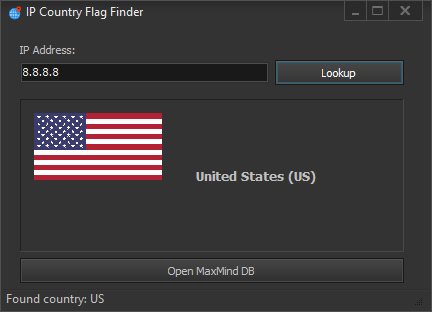

<h1 align="center">DelphiGeoLocator</h1>

  A lightweight Delphi VCL application for IP geolocation using MaxMind's GeoIP database to identify countries and display their flags.

  

---

## 🌎 Features
- **IP Lookup**: Quickly identify the country associated with any IP address
- **Visual Identification**: Display country flags for easy recognition
- **Multiple Database Support**: Compatible with various MaxMind GeoIP database formats
- **Simple UI**: User-friendly interface with intuitive controls
- **Status Updates**: Integrated status bar provides real-time feedback
- **Flag Display**: Automatic loading of country flags in PNG or JPG formats

## 🔍 Overview
This application demonstrates how to implement IP geolocation in Delphi applications using MaxMind's GeoIP database. Key components include:

- **TMMDBReader**: Core component for reading MaxMind database files
- **IP Parsing**: Conversion from string format to usable IP address objects
- **Database Selection**: Open and select different MaxMind database files
- **Country Identification**: Extract country codes and names from IP lookup
- **Flag Display**: Load and display country flags based on ISO country codes

## 🛠️ Requirements
- **Delphi RAD Studio**: Developed and tested with recent versions
- **VCL Components**: Uses standard Visual Component Library
- **MaxMind GeoIP Database**: Requires a MaxMind database file (.mmdb)
- **Country Flags**: Requires flag images in PNG or JPG format (not included)

## 📋 Usage Instructions
1. Launch the application
2. Click "Open DB" to select a MaxMind GeoIP database file
3. Enter an IP address in the provided field
4. Click "Lookup" to retrieve country information
5. View country name, code, and flag (if available)

## 💾 Database Resources
MaxMind offers various GeoIP databases:
- Free GeoLite2 databases available with registration
- Commercial GeoIP2 databases for higher accuracy

Visit [MaxMind's website](https://www.maxmind.com) for more information.

## 🏁 Flag Resources
Country flags should be placed in a "Flags" directory in the same location as the executable.
- Flags should be named using the two-letter ISO country code (e.g., US.png)
- Supported formats: PNG and JPG (PNG recommended)

## ⚙️ Implementation Details
- **Database Handling**: Supports both Country and City type databases
- **Flag Loading**: Automatically tries different formats and provides status feedback
- **Error Handling**: Comprehensive error reporting for database and flag loading issues

## 📜 License
This project is provided as is for educational and research purposes. Use at your own risk.

## 📧 Contact
Discord: bitmasterxor

Made with ❤️ by BitmasterXor, using Delphi RAD Studio

